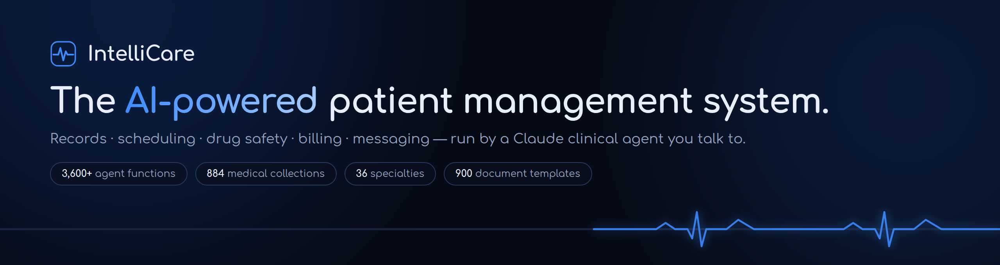

<div align="center">

  <a href="https://erangross27.github.io/erangross27/"></a>

  # IntelliCare — AI-Powered Patient Management System

  ### *A complete patient management system — records, appointments, documents, billing, and messaging — run by a Claude-powered clinical agent you talk to in plain language.*

  <br/>

  <!-- ▶ Live site (GitHub profiles can't auto-redirect, so this is the front door) -->
  [](https://erangross27.github.io/erangross27/)

  <br/><br/>

  
  
  
  
  

  <p>
    
    
    
    
    
  </p>

  ---

  **IntelliCare is the software a clinic runs on — patient records, appointments, clinical documents, billing and insurance, and patient messaging in one system — with a Claude Opus 4.8 clinical agent built in that can operate all of it for you: find a patient, answer questions from the chart, check drug safety, book the visit, and write the paperwork.**

  ### 🔗 Live platform → **https://erangross27.github.io/erangross27/**

</div>

---

## What is IntelliCare?

IntelliCare is a **patient management system (PMS)** — the central software a medical practice uses to run its day. In one place, a clinic can:

- **Register and manage patients** — demographics, insurance, full medical history
- **Keep the complete medical record** — visits, labs, imaging, prescriptions, and every specialty document, structured across **884 medical collections** and 36 specialties
- **Schedule** — appointments, follow-ups, doctor availability, and reminders
- **Handle the money** — charges, invoices, payments, insurance verification and claims
- **Communicate** — encrypted staff chat, patient SMS/email, and portal messages

What makes IntelliCare different from a traditional patient management system is that **an AI agent sits on top of all of it**. Instead of clicking through menus and forms, you ask in plain language — and the agent finds the patient, reads the chart, runs the safety checks, books the slot, or files the document for you.

---

## What the AI Agent Can Do For You

The agent is powered by **Claude Opus 4.8** with **3,600+ functions** covering every part of the system. You type (or say) what you need; it picks the right tools and does the work:

| You ask | The agent does |
|---------|----------------|
| *"What did Sarah Cohen's last colonoscopy show?"* | Finds the patient, pulls the right records from 884 collections, and answers with the findings — sources attached |
| *"Any conflicts before I prescribe warfarin?"* | Checks interactions against the active medication list, screens allergies, surfaces black-box warnings, and suggests safer alternatives |
| *"Book her a follow-up next Tuesday morning"* | Finds open slots, schedules the appointment, and can send the patient a confirmation |
| *"Write up today's visit as a SOAP note"* | Drafts the note from the visit (or a recorded transcript) and files it to the correct record type |
| *"Interpret these labs and trend her blood pressure"* | Interprets lab results against reference ranges, analyzes vital-sign trends, and recommends follow-up tests |
| *"Verify coverage and submit the claim"* | Verifies insurance, suggests the ICD codes, generates the invoice, and submits the claim |
| *"Remind tomorrow's patients to confirm"* | Sends bulk SMS/email confirmations, refill reminders, and test-result notifications |
| *"How did the clinic do this month?"* | Pulls clinic statistics, revenue reports, outstanding balances, and patient-flow analysis |

Under the hood, those 3,600+ functions break down into:

- **Complete record access** — read, create, update, and delete tools for **every one of the 884 medical collections**, discovered on demand via Anthropic's native Tool Search
- **Clinical intelligence** — symptom analysis, differential diagnosis, test recommendations, lab interpretation, vital-sign trend analysis
- **Drug safety** — interaction checking, allergy screening, prescribing info, black-box warnings, dosage, pregnancy safety, alternatives, and formulary coverage (OpenFDA, RxNorm, DailyMed)
- **Scheduling** — appointments, availability search, rescheduling, cancellations, follow-ups, and doctor calendars
- **Billing & insurance** — charges, invoices, payments, payment plans, insurance verification, claims, ICD-10 code search and suggestion
- **Patient outreach** — bulk SMS and email, appointment confirmations, refill reminders, test-result notifications, portal messages
- **Practice operations** — clinic statistics, revenue reports, patient-flow analysis, user and role management, backups, and system health

If it's in IntelliCare, the agent can do it — every action respects the same role-based permissions and audit logging as the UI.

---

## Platform at a Glance

<table>
<tr>
<td width="50%" valign="top">

### Engineering Scale
| Metric | Count |
|--------|-------|
| Lines of Code | **2M+** |
| Git Commits | **4,500+** |
| Backend Service Modules | **290+** |
| API Route Modules | **68 core + 896 edit** |
| Data Models | **38** |
| Middleware Layers | **29** |
| Backend Dependencies | **86** |
| Source Files | **7,200+** |

</td>
<td width="50%" valign="top">

### Medical Coverage
| Metric | Count |
|--------|-------|
| Document Templates | **900** |
| PDF Export Templates | **963** |
| Medical Collections | **884** |
| Medical Data Fields | **23,000+** |
| AI Agent Functions | **3,600+** |
| Specialty Field-Mapping Modules | **35** |
| External API Integrations | **25** |
| Learning System Services | **20** |

</td>
</tr>
</table>

---

## Core Capabilities

### 🧠 Conversational Clinical AI Agent

A true agentic assistant powered by **Claude Opus 4.8**, built as a **custom agentic loop directly on the Anthropic API** (`@anthropic-ai/sdk`):

- **Native Tool Search** — Claude discovers and selects from **3,600+ medical functions** on demand via Anthropic's server-side Tool Search (`tool_search_tool_bm25`) with deferred tool loading, scaling to thousands of tools without consuming the context window
- **Autonomous agentic loop** — Claude selects tools, the backend executes them immediately against the live (RBAC-secured) database, results return to Claude, and it decides whether to call more tools or answer — up to **15 iterations** per request
- **Real-time streaming** of text, summarized thinking, and tool-execution progress over Server-Sent Events
- **1M-token context window** for complete patient histories and multi-document reasoning, with a 980K usable budget
- **Prompt caching** on the system prompt for lower latency and cost
- **Patient context persistence** across conversation turns, with today's date injected for correct scheduling logic

### 🎙️ Real-Time Voice — Scribe & Voice-Over

Two-way voice built on **ElevenLabs**:

- **Medical scribe (speech-to-text)** — record a patient visit and it transcribes live with speaker labels via **ElevenLabs Scribe v2 Realtime**; the encrypted audio and full transcript are saved to the patient's visit record
- **Hands-free voice chat** — talk to the AI agent and have answers spoken back, with echo-prevention and auto-reconnect
- **Voice patient lookup** — find a patient just by saying their name
- **Voice-over (text-to-speech)** — read any assistant message aloud in a natural voice, with user-selectable voice and model

### 💬 Real-Time Staff Collaboration

An encrypted, WhatsApp-style chat for clinical teams, over **Socket.IO**:

- **1:1 and group conversations** with message content **AES-256-GCM encrypted at rest**
- **Live presence, typing indicators, read receipts, and emoji reactions**
- Reply/quote, pin, mute, soft-delete and delete-for-everyone, message & conversation search, unread counts
- Real-time **notifications** for appointments, document/batch AI processing progress, and permission requests

### 📄 Automated Document Analysis Pipeline

Converts unstructured medical documents into structured, queryable clinical data:

- **Two-pass Claude Batch API** extraction — Phase 1 selects the relevant collections from lightweight descriptors (~95% token savings); Phase 2 forces a single composite extraction tool built from only the selected schemas (≈50% bulk-processing cost savings)
- **23,000+ structured field extraction** across 884 collections with **35 specialty-specific field-mapping modules**
- **Dual-path storage** — one complete unified document plus granular per-collection records for fast querying
- **SHA-256 content-hash deduplication** prevents reprocessing duplicates
- **DICOM + medical-image analysis** via `dicom-parser` and **Claude Vision** for structured findings

### 🗂️ 900 Specialized Document Templates

Each medical data type has a dedicated React view (**963 paired PDF templates**):

- **Live multi-level search** with real-time `<mark>` highlighting across documents, sections, rows, and fields
- **Copy-to-clipboard** per section or full document, in clinically formatted text
- **Professional PDF export** via `@react-pdf/renderer` with medical-grade B&W formatting
- **Inline editing with defer-save** — edits persist as private drafts and only reach the record on explicit approval
- **Dynamic lazy loading** so hundreds of templates never bloat the initial bundle

### 💊 Drug Safety & Clinical Decision Support

- **OpenFDA** integration for interaction checking, contraindication detection, and adverse-event/recall monitoring
- **RxNorm / RxNav** medication normalization and **DailyMed** prescribing information
- **Real-time, severity-rated safety alerts** (major / moderate / minor) for dangerous combinations

### 🔐 Identity & Access Management

Enterprise-grade, healthcare-oriented identity from the database up:

- **Multi-tenant, database-per-organization isolation** — each practice gets a physically separate database
- **Passwordless sign-in** (email magic links + 6-digit OTP), legacy JWT, and a **zero-knowledge SRP-6a** option
- **TOTP multi-factor authentication** with backup codes, optionally required org-wide
- **Role-based access control** — **14 roles** and a **1,786-permission** catalog (read/write across all 884 collections)
- **Zero-trust service accounts** — every internal service authenticates with least-privilege scoping and auto-suspension
- **Risk-scored sessions** with device fingerprinting and immutable audit logging

### 🤖 Intelligent Learning System

A **20-service** subsystem that continuously improves the platform:

- Function interceptor captures usage patterns; **sequence & temporal pattern engines** model real clinical workflows
- **Bottleneck detection** and **automation-opportunity scoring** with ROI estimates
- **User memory**, **personal assistant**, and a **workflow predictor** that anticipates next actions

---

## How It Works

```
  01 · INGEST        02 · EXTRACT          03 · STRUCTURE        04 · REASON              05 · DELIVER
  ───────────        ──────────────        ─────────────         ──────────              ───────────
  Voice visits,      Two-pass Claude       Dual-path storage:    Opus 4.8 agent          900 templates,
  PDFs, labs, and    Batch pipeline        one unified record    discovers tools via     voice, and chat
  DICOM images       selects collections   + granular records    native Tool Search      surface the answer —
  arrive encrypted   then extracts the     across 884            and chains them in       searchable, copyable,
  at rest.           structured fields.    collections.          an autonomous loop.      exportable to PDF.
```

---

## Architecture Overview

```
                    ┌──────────────────────────────────────────────┐
                    │              FRONTEND                          │
                    │  React 19 + Vite + Chakra UI + MUI            │
                    │  ├─ Conversational AI chat (SSE streaming)    │
                    │  ├─ Artifact panel (multi-level navigation)   │
                    │  ├─ 900 document + 963 PDF templates          │
                    │  ├─ Voice scribe + voice-over (ElevenLabs)    │
                    │  ├─ Real-time staff chat (Socket.IO)          │
                    │  └─ i18n + RTL language support               │
                    └──────────────────┬───────────────────────────┘
                                       │  HTTPS / TLS · SSE · WebSocket
                    ┌──────────────────▼───────────────────────────┐
                    │              BACKEND API                       │
                    │  Node.js / Express 5 / GraphQL               │
                    │  ├─ Agentic loop (Claude Opus 4.8) +          │
                    │  │   native Tool Search over 3,600+ tools     │
                    │  ├─ Two-pass Batch document processor         │
                    │  ├─ 35 specialty field-mapping modules        │
                    │  ├─ Identity & access (multi-tenant, RBAC)    │
                    │  ├─ 20-service learning system                │
                    │  ├─ External API gateway (25 integrations)    │
                    │  └─ 29 middleware layers · OpenTelemetry      │
                    └──────────────────┬───────────────────────────┘
                    ┌──────────────────▼───────────────────────────┐
                    │              DATA LAYER                        │
                    │  MongoDB 8 + Redis                            │
                    │  ├─ Database-per-organization isolation       │
                    │  ├─ 884 medical collections                   │
                    │  ├─ AES-256-GCM field-level encryption        │
                    │  └─ Immutable, hash-chained audit logs        │
                    └──────────────────────────────────────────────┘
```

---

## Security Architecture

IntelliCare implements **defense-in-depth** designed for healthcare compliance:

| Layer | Implementation |
|-------|----------------|
| **Data Isolation** | Database-per-organization multi-tenant architecture with row-level scoping on every query |
| **Encryption** | AES-256-GCM field-level encryption at rest (envelope KMS with a master-key hierarchy), HTTPS/TLS in transit |
| **Identity** | Passwordless (magic-link + OTP), TOTP MFA with backup codes, zero-knowledge SRP-6a, cookie-based server sessions with CSRF |
| **Access Control** | RBAC with 14 roles and 1,786 permissions, zero-trust service accounts with least-privilege scoping, risk-scored sessions |
| **Audit** | Immutable, hash-chained audit logs of all data access, with breach-notification and configurable retention |
| **API Security** | Rate limiting, circuit breakers, MongoDB-injection validation, GraphQL depth limiting, Helmet, request threat detection |
| **Compliance** | HIPAA-aligned data handling, PHI anonymization for research |

---

## Technology Stack

### Backend
| Category | Technologies |
|----------|--------------|
| **Runtime & Framework** | Node.js, Express 5, GraphQL (Apollo Server) |
| **AI & LLM** | Anthropic Claude Opus 4.8 (`@anthropic-ai/sdk`), native Tool Search, Batch API, Claude Vision |
| **Database** | MongoDB 8, Mongoose 9, Redis |
| **Voice & Realtime** | ElevenLabs Scribe v2 (STT) + TTS, Socket.IO, WebSocket (`ws`), Server-Sent Events |
| **Observability** | OpenTelemetry, custom category-based logging with rotation |
| **Communication** | SendGrid, Twilio (SMS), Nodemailer, Google Calendar |
| **File Processing** | DICOM (`dicom-parser`), PDF complexity analysis, Claude-native document reading |
| **Security** | Helmet, bcryptjs, jsonwebtoken, speakeasy (TOTP), secure-remote-password (SRP-6a) |
| **External APIs** | OpenFDA, CMS (Provider Directory, Blue Button 2.0, Medicaid), ClinicalTrials.gov, NIH RePORTER, PubMed, RxNorm, DailyMed, Google Cloud Healthcare/FHIR |

### Frontend
| Category | Technologies |
|----------|--------------|
| **Framework** | React 19, Vite |
| **UI Libraries** | Chakra UI, Material UI, Tailwind CSS, Framer Motion |
| **State** | Zustand, React Context |
| **PDF Generation** | `@react-pdf/renderer` |
| **Real-time** | Socket.IO client, `@elevenlabs/client`, Web Audio API |
| **Internationalization** | i18next with RTL support |
| **Icons** | Lucide React, MUI Icons |

---

## Medical Specialty Coverage

**884 medical collections** with **23,000+ structured fields** across **36 specialties**, each with dedicated field-mapping modules, document templates, and extraction schemas:

<table>
<tr>
<td width="25%" valign="top">

- Allergy & Immunology
- Anesthesiology
- Cardiology
- Colorectal Surgery
- Dental
- Dermatology
- Emergency Medicine
- Endocrinology
- ENT

</td>
<td width="25%" valign="top">

- Family Medicine
- Gastroenterology
- Geriatrics
- Hematology
- IBD
- Infectious Disease
- Medical Genetics
- Nephrology & Dialysis
- Neurology

</td>
<td width="25%" valign="top">

- Neurosurgery
- Nuclear Medicine
- Obstetrics & Gynecology
- Oncology
- Ophthalmology
- Orthopedics
- Pathology
- Pediatrics
- Physical Medicine & Rehab

</td>
<td width="25%" valign="top">

- Plastic Surgery
- Preventive Medicine
- Psychiatry
- Pulmonology
- Radiology
- Rheumatology
- Surgery (General)
- Thoracic Surgery
- Urology

</td>
</tr>
</table>

---

## External API Integrations

**25 distinct integrations**, most routed through a single gateway with caching, rate limiting, and circuit breakers:

| Provider | APIs | Purpose |
|----------|------|---------|
| **FDA** | OpenFDA (events, labels, enforcement, NDC, devices), iRES, Data Dashboard, Product Code Builder, Establishment ID | Drug safety, recalls, device monitoring |
| **CMS** | Provider Directory, Blue Button 2.0 (OAuth + FHIR R4), Medicaid Data (DKAN) | Provider lookup, Medicare claims import, Medicaid datasets |
| **NIH / NLM / NCBI** | ClinicalTrials.gov, NIH RePORTER, PubMed, RxNorm, DailyMed | Trials, research, literature, drug normalization |
| **Google** | Cloud Healthcare API (FHIR), Calendar | Interoperability, appointment sync |
| **Voice & Messaging** | ElevenLabs (TTS + STT), SendGrid, Twilio (SMS) | Voice scribe/voice-over, email, SMS |
| **Security** | VirusTotal, AlienVault OTX, abuse.ch | File / threat reputation |

---

## Key Engineering Highlights

### Engineering Depth
- **4,500+ commits** and **2M+ lines** of production code
- A production-ready enterprise platform — backend, frontend, AI, voice, chat, identity, and security

### AI Integration Depth
- Custom agentic loop on the Anthropic SDK with **native Tool Search over 3,600+ medical functions**
- **Two-pass Batch extraction** pipeline turning unstructured documents into 23,000+ structured fields
- **Medical image analysis** with DICOM support and Claude Vision

### Scale of the Template System
- **900 document templates** + **963 PDF templates**, each with multi-level search, copy, defer-save editing, and PDF export
- **Dynamic lazy loading** that prevents multi-megabyte initial bundles

### Platform Breadth
- Real-time **voice scribe**, **encrypted staff chat**, a **20-service learning system**, and full **identity & access management** (multi-tenant, MFA, RBAC, zero-trust)

---

## Development Methodology

Built using a disciplined **AI-assisted development workflow**:

- **Claude Code** (Anthropic's official coding agent) with **Claude Opus 4.8** throughout
- **MCP memory server** for persistent architectural knowledge across sessions
- **Custom skills system** for brainstorming, debugging, code review, TDD, and frontend design
- **Template checklists** ensuring consistency across all 900 document templates
- **Automated route validation** wired to commit hooks to prevent AI-written backend regressions

---

## Project Status

| Area | Status |
|------|--------|
| Core Platform | Production Ready |
| AI Agent (Claude Opus 4.8) | Production Ready |
| Document Analysis Pipeline | Production Ready |
| 900 Document Templates | Production Ready |
| Voice Scribe & Voice-Over | Production Ready |
| Real-Time Staff Chat | Production Ready |
| Identity & Access Management | Production Ready |
| Drug Safety (OpenFDA) | Production Ready |
| Multi-Tenant Security | Production Ready |
| Learning System | Active Development |
| FHIR Interoperability | In Progress |

---

## About This Repository

This is a **private repository**. This README and the [live platform site](https://erangross27.github.io/erangross27/) are shared for portfolio purposes to demonstrate the scope and technical depth of the project. IntelliCare is an AI-powered patient management system designed for clinics and healthcare organizations that want one system for records, scheduling, billing, and communication — operated by a clinical AI agent.

### Contact

- **Developer**: Eran Gross
- **Live platform**: [erangross27.github.io/erangross27](https://erangross27.github.io/erangross27/)
- **GitHub**: [@erangross27](https://github.com/erangross27)

---

<div align="center">
  

  **Built with Claude Opus 4.8 · AI-Powered Patient Management · 2M+ Lines of Code**

</div>
